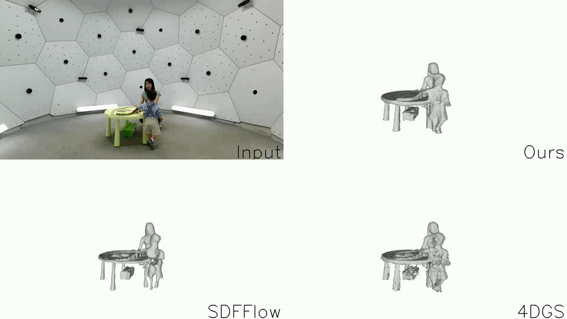

  <h1 align="center">Space-time 2D Gaussian Splatting for Accurate Surface Reconstruction under Complex Dynamic Scenes</h1>
  

    Shuo Wang1</strong></a>
    ·
    Binbin Huang2</strong></a>
    ·
    Ruoyu Wang1</strong></a>
    ·
    <a href="https://scholar.google.com.sg/citations?user=fe-1v0MAAAAJ&hl=en"><strong>Shenghua Gao2</strong></a>
     
     
        
        
     
    <b> ShanghaiTech University |&nbsp;The University of Hong Kong  </b>
    

    
  <table align="center">
    <tr>
    <td>
      
    </td>
    </tr>
  </table>
  
# Demo
  <table align="center">
    <tr>
    <td>
      
    </td>
    </tr>
  </table>

# Code

Coming soon in the future.

# Bibtex
